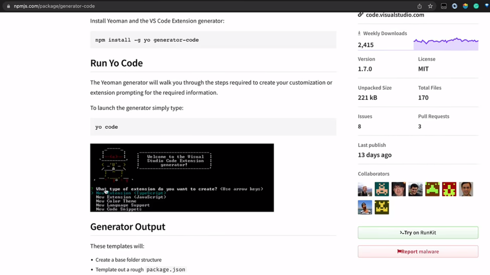
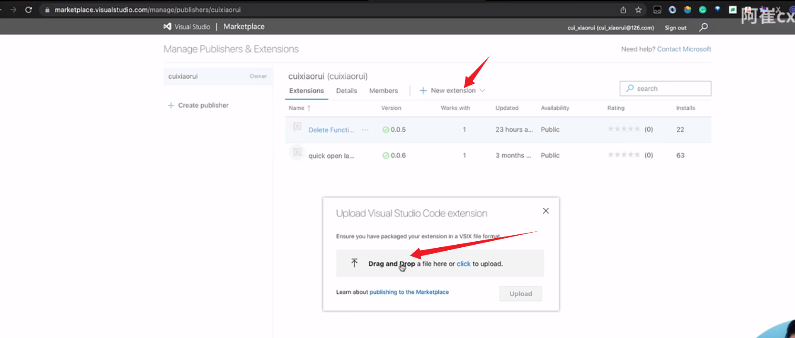

### 实现vscode插件


第一步：
npm install -g yo generator-code

第二步：
yo -> Code


第三步：
安装完会提示是否打开这个项目


进入项目中 运行 pnpm run compile 
生成 out 目录


进入想要调试的文件，按F5 就会帮我们新打开一个窗口,demo中有一个hello world 的命令

我们在新窗口中输入命令之后回车就能进入到 设置的断点的位置了 


通过文本来指定范围，
vscode支持的函数


要获取到function 的位置 我们需要利用ast，我们需要做的是光标在function 上时 返回对应的范围 

那么我们需要先安装balel traverse 可以遍历生成ast树
pnpm i @babel/parser @babel/traverse

安装完成之后引入一下
```
import { parse } from '@babel/parser';
import traverse from '@babel/traverse';
```
然后我们就可以解析我们的代码了
parse(code)


因为我们需要频繁的调用 parse 方法来测试，所以我们可以使用单元测试来测试我们的方法，就不需要每次都按 F5 来测试了
安装测试框架
pnpm i vitest -D
然后我们就可以在 test 文件夹中编写测试代码了

小步走测试 我们先创建一个测试文件夹 然后创建一个 test.spec.ts 文件 看是否安装成功vitest

```
import { expect, test } from 'vitest';

test("init", () => {
    expect(true).toBe(true);
});
```
提示我们安装一下 
pnpm i --save-dev @types/babel__traverse 

在tsconfig.json 中配置一下


main.ts 实现逻辑
```
import { parse } from '@babel/parser';
import traverse from '@babel/traverse';
interface FunctionNode {
    name: string;
    start: {
        line: number; column: number; index: number
    };
    end: {
        line: number; column: number; index: number
    }
}
export function getFunctionNode(code: string, index: number): FunctionNode | undefined {
    let functionNode;
    const ast = parse(code);
    traverse(ast, {
        FunctionDeclaration(path) {
            console.log(path.node);
            if (index >= path.node?.start! && index <= path.node?.end!) {
                functionNode = {
                    name: path.node?.id?.name,
                    start: path.node?.loc?.start,
                    end: path.node?.loc?.end,
                }
            }
        },
        ArrowFunctionExpression(path) {
            // 箭头函数的解析
            const variableDeclaratorPath = path.parentPath.parentPath;
            function getName() {
                return Object.keys(path.parentPath.getBindingIdentifiers())[0]
            }
            // 判断是否为变量声明语句
            if (variableDeclaratorPath?.isVariableDeclaration()) {
                if (index >= variableDeclaratorPath.node?.start! && index <= variableDeclaratorPath.node?.end!) {
                    functionNode = {
                        name: getName(),
                        start: variableDeclaratorPath.node?.loc?.start,
                        end: variableDeclaratorPath.node?.loc?.end,
                    }
                }
            }
        }
    });
    return functionNode;
}
```

单元测试
```
import { expect, test } from 'vitest';
import { getFunctionNode } from '../src/main.ts';

test("init", () => {
    const code = `
    function getName(){
        return "张三";
    }
    function getName2(){
        return "张三";
    }
    `;
    const index = 10;
    const functionNode = getFunctionNode(code,index);
    expect(functionNode).toEqual({
        name: 'getName',
        start: {
            line: 2, column: 4, index: 5
        },
        end: {
            line: 4, column: 5, index: 51
        }
    });
});
```

extension.ts 实现代码
```
import * as vscode from 'vscode';
import { getFunctionNode } from './main';


export function activate(context: vscode.ExtensionContext) {

	console.log('Congratulations, your extension "teach-vscode-extension-del-fun" is now active!');

	let disposable = vscode.commands.registerCommand('teach-vscode-extension-del-fun.helloWorld', () => {
		vscode.window.showInformationMessage('Hello World from teach-vscode-extension-del-fun!');
		// vscode 中应该如何删除字符
		const editor = vscode.window.activeTextEditor;
		if (!editor) { return; }

		const code = editor.document.getText();// 获取文件内容
		const active = editor.selection.active;// 获取光标位置
		const index = editor.document.offsetAt(active);// 获取光标所在位置的索引

		const functionNode = getFunctionNode(code, index);// 获取光标所在函数

		if (!functionNode) { return; }
		editor.edit((editBuilder) => {
			editBuilder.delete(new vscode.Range(new vscode.Position(functionNode.start.line - 1, functionNode.start.column),
				new vscode.Position(functionNode.end.line - 1, functionNode.end.column)));
		});
	});

	context.subscriptions.push(disposable);
}

export function deactivate() { }
```

### 发布
安装一下 vsce
```
npm install -g vsce
```
然后登陆 
```
vsce login XXX
```

登陆完成的样子

获取token

创建 找到管理市场打开

点击复制

然后粘贴

可以先打个包执行

如果报上面的错误，我们可以指定一下用 yarn安装

如果还是报错，因为我们是使用的pnpm 安装的，那么我们可以先删除 node_modules 文件夹

然后重新用 yarn 安装,这样就能生成 lock文件了,提示我们 README.md 没有修改描述，修改完再次执行就成功了

最后会生成一个 vsix 文件，这个文件就是插件的安装包

上传插件 


还可以使用 publish 命令来发布插件
```
vsce publish --yarn
```
需要增加 publisher 名字


使用快捷键来进行删除函数
